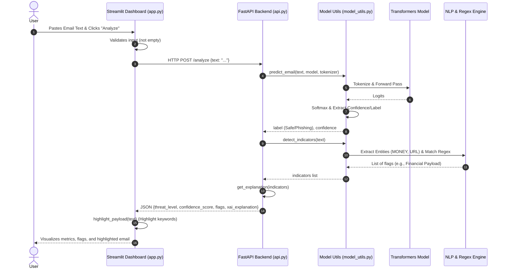
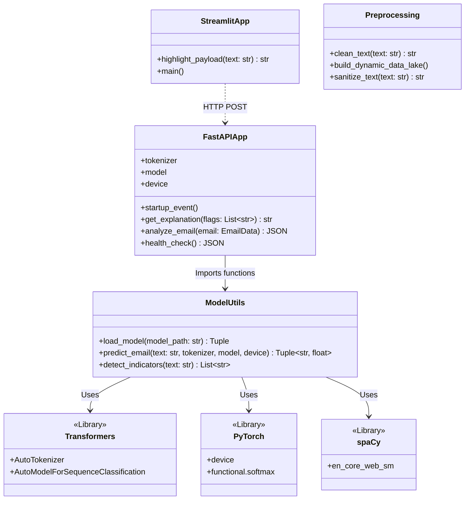

# senseflowfrontend

# Experiment: Phishing Detection System using RoBERTa

## 1. Aim
To design and implement a machine learning-based phishing detection system (SenseFlow) utilizing a transformer-based language model (RoBERTa) to analyze email text and accurately identify potential phishing threats.

## 2. Requirements
**Hardware Requirements:**
*   PC/Laptop with minimum 8GB RAM (16GB recommended).
*   Modern multi-core CPU (GPU optional but recommended for faster model inference).

**Software Requirements:**
*   **Operating System**: Windows 10/11, Linux, or macOS.
*   **Programming Language**: Python 3.8 or higher.
*   **Libraries/Packages**: 
    *   `fastapi` & `uvicorn` (Backend server)
    *   `streamlit` (Frontend UI)
    *   `transformers` & `torch` (Hugging Face RoBERTa model)
    *   `pydantic` (Data validation)

## 3. Procedure
1.  **System Architecture Design**: Separate the application into a frontend (Streamlit) for user interaction and a backend (FastAPI) for processing heavy model inferences.
2.  **Model Loading**: Initialize the pre-trained RoBERTa model at the backend application startup to minimize prediction latency.
3.  **Preprocessing**: Implement text preprocessing logic to clean the input email payload, handle punctuation, and normalize text casing.
4.  **Inference Pipeline**: 
    *   Create a REST API endpoint (`/analyze`) that receives email text.
    *   Tokenize the text and pass it through the RoBERTa model to get a confidence score and a threat label ("Phishing" or "Safe").
5.  **Heuristic Scanning**: Complement the ML model by extracting hardcoded phishing indicators (e.g., urgency phrases like "act now", "account suspended") using Regular Expressions.
6.  **XAI (Explainable AI)**: Generate a user-friendly explanation based on the detected indicators to clarify *why* the model made its decision.
7.  **Frontend Development**: Create a Streamlit interface that accepts user input, makes an HTTP POST request to the backend, and visualizes the results (highlighting suspicious words and displaying confidence scores).
8.  **Execution**: Run the backend server (`uvicorn`) and the frontend interface (`streamlit run`) concurrently.

## 4. Program (Core Snippets)

**Backend API (`api.py` snippet):**
```python
@app.post("/analyze")
async def analyze_email(email: EmailData):
    # Predict using RoBERTa model
    label, confidence = predict_email(email.text, tokenizer, model, device)
    
    # Detect hardcoded patterns (heuristics)
    indicators = detect_indicators(email.text)
    explanation = get_explanation(indicators)

    return {
        "threat_level": label,
        "confidence_score": round(float(confidence), 2),
        "flags": indicators,
        "xai_explanation": explanation
    }
```

**Frontend Dashboard (`app.py` snippet):**
```python
import streamlit as st
import requests

st.title("🛡️ SenseFlow Phishing Detection")
email_text = st.text_area("Paste the suspected email here:")

if st.button("🚀 Analyze Email"):
    resp = requests.post("http://localhost:8000/analyze", json={"text": email_text})
    result = resp.json()
    
    if result["threat_level"] == "Phishing":
        st.error(f"🚨 HIGH RISK - PHISHING DETECTED ({result['confidence_score']}%)")
    else:
        st.success(f"✅ SAFE ({result['confidence_score']}%)")
        
    st.info(result["xai_explanation"])
```

## 5. Output
The system produces a visual dashboard where users can input text. The output consists of:
*   **Threat Status**: A clear banner indicating if the email is Safe (✅) or Phishing (🚨).
*   **Confidence Score**: A percentage representing the RoBERTa model's certainty (e.g., 98.4%).
*   **Detected Indicators**: A list of suspicious flags found in the text (e.g., "Generic Greeting").
*   **AI Explanation**: A short text explaining the rationale behind the flags.
*   **Highlighted Payload**: The original email text with urgent or suspicious words highlighted in red.

## 6. Result
The SenseFlow Phishing Detection System was successfully implemented. The integration of a RoBERTa transformer model with a FastAPI backend and a Streamlit frontend allows for accurate, real-time, and explainable detection of phishing emails. 

---

# Study Material & Important Points (Viva/Presentation Prep)

### 1. What is RoBERTa?
*   **Concept**: RoBERTa stands for **R**obustly **O**ptimized **BERT** **A**pproach. It is an advanced NLP (Natural Language Processing) model based on the Transformer architecture.
*   **Why use it here?**: It is highly effective at understanding the *context* and *intent* of sentences, making it far superior to simple keyword-matching when detecting deceptive phishing techniques.

### 2. Why the Two-Tier Architecture (FastAPI + Streamlit)?
*   **FastAPI** is designed for high-performance backend serving. Running an AI model is computationally heavy; placing it in a separate backend ensures the UI doesn't freeze during analysis.
*   **Streamlit** is used because it allows fast and interactive UI generation using only Python, which is ideal for Data Science and ML projects.

### 3. What is XAI (Explainable AI)?
*   In this project, the XAI component provides transparency. Instead of just saying "This is phishing", the system detects specific indicators (like "account suspended" or "urgent request") and gives the user a readable explanation. This builds trust in the AI's decision.

### 4. How does the Prediction Pipeline work?
1.  **Input generation**: User pastes text in the Streamlit UI.
2.  **API request**: Streamlit sends a JSON request to the FastAPI endpoint (`/analyze`).
3.  **Tokenization**: The input text is split into tokens (words/sub-words) that the RoBERTa model can understand.
4.  **Inference**: The model calculates the mathematical probability of the text belonging to the "Phishing" or "Safe" class.
5.  **Response generation**: The result is sent back to Streamlit and rendered for the user.


```
User pastes email in Streamlit Dashboard 
        ↓
Streamlit calls FastAPI backend[](http://localhost:8000/analyze)
        ↓
FastAPI receives the email text
        ↓
RoBERTa model (in model_utils.py) analyzes the text
        ↓
detect_indicators() finds suspicious patterns (urgency, money, login, etc.)
        ↓
FastAPI returns JSON response:
        {
          "threat_level": "Phishing" or "Safe",
          "confidence_score": 99.99,
          "flags": ["Credential Harvesting", "Urgency / Time Pressure"],
          "model_used": "ROBERTA"
        }
        ↓
Streamlit shows the result with gauge + highlighted text
```


# SenseFlow Architecture Diagrams

Here are the Mermaid diagrams representing the architecture, flow pipeline, and class structure of the SenseFlow project. You can view these directly or copy the Mermaid code to use in your own documentation.

## 1. System Flow Pipeline Diagram

This flowchart illustrates the end-to-end process from data ingestion and model loading to user interaction and prediction.

```mermaid
graph TD
    %% Define Styles
    classDef frontend fill:#4CAF50,stroke:#388E3C,stroke-width:2px,color:white;
    classDef backend fill:#2196F3,stroke:#1976D2,stroke-width:2px,color:white;
    classDef processing fill:#FF9800,stroke:#F57C00,stroke-width:2px,color:white;
    classDef model fill:#9C27B0,stroke:#7B1FA2,stroke-width:2px,color:white;
    classDef data fill:#607D8B,stroke:#455A64,stroke-width:2px,color:white;

    %% Components
    subgraph Data Pipeline
        A1[Raw CSV / Excel] ::: data
        A2[preprocessing.py\nData Lake Builder] ::: processing
        A3[Processed CSV] ::: data
        A1 --> A2
        A2 -->|Sanitizes & Merges| A3
    end

    subgraph User Interface
        U1[User Input\nEmail Text] ::: frontend
        U2[Streamlit App\napp.py] ::: frontend
        U3[Highlighting & Display] ::: frontend
        U1 --> U2
        U2 -->|Displays Results| U3
    end

    subgraph API Backend
        B1[FastAPI Server\napi.py] ::: backend
        B2[POST /analyze] ::: backend
        B1 --> B2
    end

    subgraph Model & Inference
        M1[model_utils.py] ::: processing
        M2[RoBERTa Model\nTransformers] ::: model
        M3[Indicator Detection\nRegex + spaCy] ::: model
        
        M1 -->|Loads| M2
        B2 -->|Passes Text| M1
        M1 -->|1. predict_email| M2
        M1 -->|2. detect_indicators| M3
        M2 -->|Threat Level & Score| M1
        M3 -->|Regex/NLP Flags| M1
    end

    %% Connections
    A3 -.->|Used to Train| M2
    U2 -->|HTTP POST Request| B2
    M1 -->|JSON Response| B2
    B2 -->|Returns JSON| U2
```

## 2. Sequence Diagram

This diagram shows the step-by-step interaction between the User, Frontend, API, and the Model when an email is analyzed.



## 3. Class & Module Architecture Diagram

This diagram visualizes the structural relationship between the main modules and external libraries, serving as a high-level Class/Component diagram.




## Updated CSS

```
<style>
@import url('https://fonts.googleapis.com/css2?family=Montserrat:wght@300;400;500;600;700&display=swap');

* { margin: 0; padding: 0; box-sizing: border-box; font-family: 'Montserrat', sans-serif; }

body {
    background: linear-gradient(to right, #e2e2e2, #c9d6ff);
    height: 100vh;
    display: flex;
    align-items: center;
    justify-content: center;
}

.container {
    background-color: #fff;
    border-radius: 30px;
    box-shadow: 0 10px 30px rgba(0, 0, 0, 0.25);
    width: 900px;
    max-width: 95%;
    min-height: 580px;
    padding: 40px 50px;
    position: relative;
    overflow: hidden;
}

.gauge-container {
    width: 220px;
    height: 220px;
    margin: 20px auto;
    position: relative;
}

.gauge {
    width: 100%;
    height: 100%;
    border-radius: 50%;
    background: conic-gradient(#512da8 0% var(--score), #e0e0e0 var(--score) 100%);
    display: flex;
    align-items: center;
    justify-content: center;
    position: relative;
}

.gauge::before {
    content: '';
    width: 160px;
    height: 160px;
    background: white;
    border-radius: 50%;
    position: absolute;
}

.score-text {
    position: absolute;
    font-size: 42px;
    font-weight: 700;
    color: #512da8;
    z-index: 2;
}

h1 { font-size: 28px; font-weight: 700; text-align: center; margin-bottom: 10px; }
.subtitle { text-align: center; color: #666; margin-bottom: 30px; }
</style>
```
